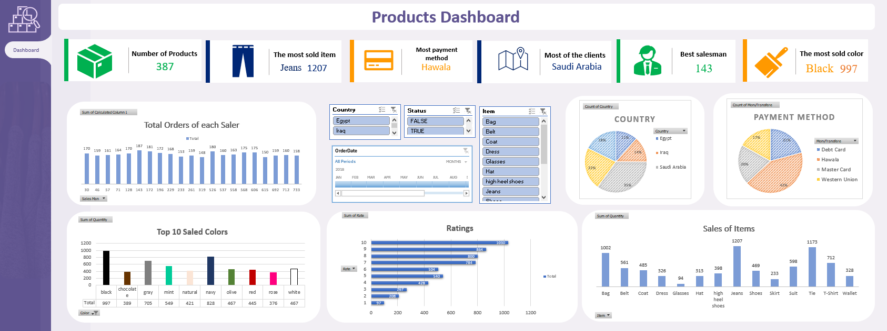

# Product Analysis

## Overview

**Product Analysis** is a data-driven project aimed at transforming raw sales data into actionable insights. By leveraging statistical analysis, structured data modeling, and interactive visualizations, this project provides a comprehensive dashboard that supports informed business decision-making.

## Objective

Transform raw sales data into clear, actionable insights that empower stakeholders to make data-driven decisions.

## Process

- **Statistical Analysis**: Conducted an in-depth statistical review to identify key trends within the sales data.
- **Data Modeling**: Built a structured data model and utilized pivot tables for efficient data aggregation.
- **Interactive Dashboard Design**: Developed a dynamic dashboard to visualize data insights and trends interactively.

## Key Features

- **Overview Metrics**:
  - Total orders
  - Best-selling items
  - Top payment methods
  - Client distribution
- **Dynamic Charts**:
  - Sales trends over time
  - Top colors in product offerings
  - Product ratings distribution
- **Interactive Filters**:
  - Country
  - Order status
  - Item type

## Data Sources

- **Raw Data Files**:
  - `Customers.xlsx`
  - `Orders.xlsx`
  - `Products.xlsx`
  
- **Complete Analysis**:
  - `Product Analysis.xlsx` — Contains comprehensive statistical analyses, visualizations, and the interactive dashboard.

## Outcome

The project culminates in a user-friendly dashboard that presents clear, actionable insights, enabling stakeholders to make well-informed business decisions quickly and efficiently.

